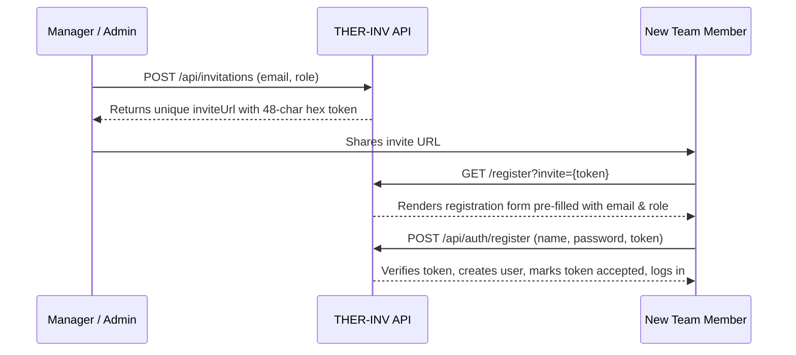

# 🔐 Authentication, RBAC & Invitations Guide

## Overview

Security in **THER-INV** is designed to keep client financial data strictly private, prevent unauthorized access, and provide granular permission tiers for team members.

---

## Role-Based Access Control (RBAC) Matrix

| Feature / Action | Admin (Roger) | Manager (Therina) | Viewer |
|---|:---:|:---:|:---:|
| **View Invoices & Reports** | ✅ | ✅ | ✅ |
| **Create & Edit Invoices** | ✅ | ✅ | ❌ |
| **Change Invoice Status (Draft -> Paid)** | ✅ | ✅ | ❌ |
| **Manage Agency Workers Directory** | ✅ | ✅ | ❌ |
| **Send User Invitations** | ✅ | ✅ | ❌ |
| **Revoke Invitations** | ✅ | ✅ | ❌ |
| **System Administration & User Deletion** | ✅ | ❌ | ❌ |

---

## Pre-Configured Accounts

| Account | Role | Default Email | Default Password |
|---|---|---|---|
| **Therina** | Manager | `therina@agency.com` | `therina123456` |
| **Roger** | Admin | `roger@admin.com` | `admin123456` |

*(Note: In development, quick-fill buttons on the login screen allow one-click access for evaluation).*

---

## Invitation Token Workflow

1. **Token Generation**: Generates 24 random bytes (`crypto.randomBytes(24).toString("hex")`).
2. **Expiration**: By default, invitations expire after 7 days (`Date.now() + 7 * 24 * 60 * 60 * 1000`).
3. **Revocation**: Managers and Admins can revoke pending invitations at any time from `/dashboard/invitations`.
