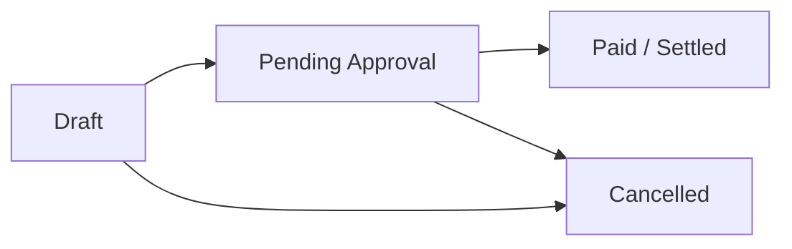

# 💵 Invoice Generation & Weekly Payroll Guide

## Overview

The weekly invoicing module is built for agency managers (such as Therina) and administrators (Roger) to calculate worker payroll hours, bill healthcare facilities, and generate clean invoices in minutes.

---

## Weekly Payroll Cycle

1. **Cycle Range**: Invoices typically cover a 7-day period (e.g., Monday through Sunday).
2. **Worker Selection**: When adding a worker to the invoice, the system retrieves their configured default hourly rate.
3. **Hourly Calculations**:
   - **Regular Hours**: Hours up to the standard threshold (e.g. 40h) charged at the base rate:
     $$\text{Regular Total} = \text{Regular Hours} \times \text{Regular Rate}$$
   - **Overtime Hours**: Additional hours charged at the overtime rate (default 1.5x):
     $$\text{Overtime Total} = \text{Overtime Hours} \times \text{Overtime Rate}$$
   - **Item Subtotal**:
     $$\text{Line Item Amount} = \text{Regular Total} + \text{Overtime Total}$$

---

## Invoice Lifecycle

- **Draft**: Default initial state while timesheets and hours are being gathered and confirmed.
- **Pending**: Submitted to client for billing and collection.
- **Paid**: Recorded as fully collected; locks financial figures.
- **Cancelled**: Voided or superseded invoice.

---

## Printing & PDF Generation

Every invoice detail page (`/dashboard/invoices/[id]`) contains a dedicated **Print / Export PDF** action.

- Styled via dedicated `@media print` CSS rules:
  - Navigation sidebars, control toolbars, and action buttons are automatically hidden.
  - Page margins and color schemes are optimized for standard 8.5x11 (Letter) printing or "Save as PDF" browser dialogs.
  - Generates crisp header, metadata table, line items breakdown, and totals summary.
